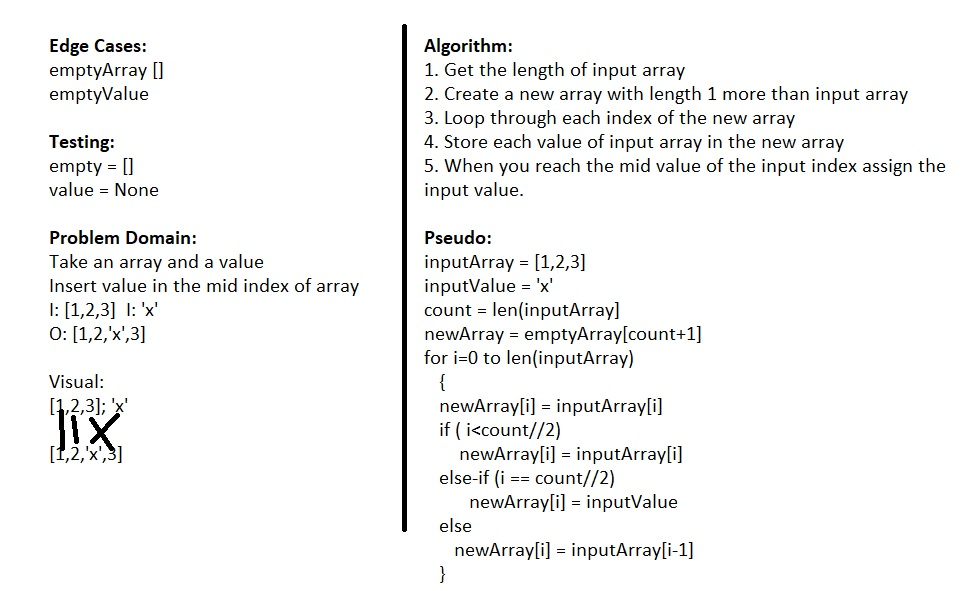

1. Reverse an Array(#reverse)
   1.1	Challenge (#reverseChallenge)
   1.2  Approach & Efficiency (#reverseApproach)
   1.3  Solution (#solution)
2. Shift Array (#shift)
   2.1	Challenge (#shiftChallenge)
   2.2  Approach & Efficiency (#shiftApproach)
   2.3  Solution (#shiftSolution)

# Reverse an Array
Get list of numbers from user and reverse the list. Also, get the number of elements in list.

## Challenge
Input list from user should contain only integers. Otherwise, process should error out. 

## Approach & Efficiency
Swap 1st and last element. Continue to swap until middle element. This reduces the iterations by half. 

## Solution

# Shift Array
Insert an element to mid index of an array

## Challenge
Insert an element to mid indes of an array. You cannot use any existing python functions for inserting

## Approach & Efficiency
Create an empty array with 1 element more than input array. Assign all indices except the mid index

## Solution

