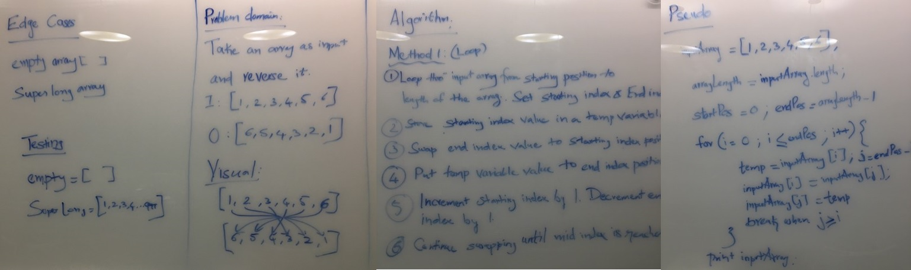

# Reverse an Array
Get list of numbers from user and reverse the list. Also, get the number of elements in list.

## Challenge
Input list from user should contain only integers. Otherwise, process should error out. 

## Approach & Efficiency
Swap 1st and last element. Continue to swap until middle element. This reduces the iterations by half. 

## Solution
